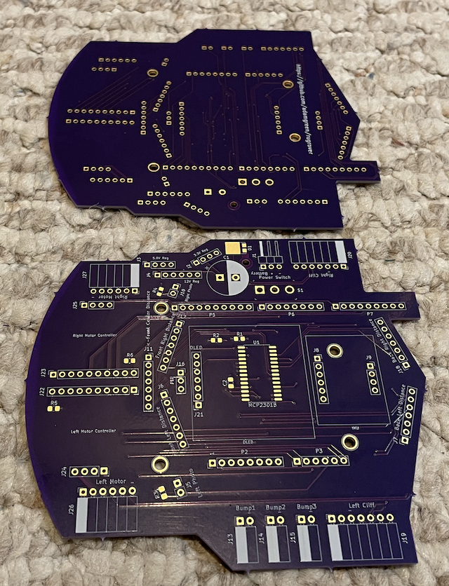

# Rug Rover


## Project Overview


When I first started pursuing robotics as a hobby back in the late 1990s, one of the first books I read was ["Mobile Robots: Inspiration to Implementation" by Joseph L. Jones and Anita M. Flynn](https://www.amazon.com/Mobile-Robots-Inspiration-Implementation-Second/dp/B0087P7X2S). I just read it again recently and the core lessons covered by the book are just as useful today as they were back at that time even though some of the technology discussed is now a bit out of date. The mechanical, electrical, motor physics, and behavior based programming topics covered are all still relevant. The Motorola 68HC11 microcontroller and Interactive C programming language are examples of some of the more dated topics.

After reading the book for the first time, I ordered one of the [Rug Warrior Pro kits](http://www.robotbooks.com/rug_warrior.htm) and assembled it. I enjoyed putting it together but never did a lot of experimentation with it as I never really got one of the wheel encoders to work properly. It seemed to pick up noise from the motor as erroneous encoder tick counts.


Having recently reread the book, I thought it would be fun to build a comparable robot using more recent technology. This Rug Rover project is my attempt to build such a robot. It features will include:
* Similar sensors/actuators:
  * Motors with encoders
  * IR proximity sensors
  * Bumper switches
  * Microphone
  * Speaker
  * Pyroelectric sensor
  * Photo Cell light level detectors
  * LCD
* Add in IR based downward facing cliff detectors so that I can run the robot in my loft and hopefully write software that stops it from trying to make a run down the stairs.
* More modern nRF52 BLE capable microcontroller:
  * Exploit the BLE capabilities of this microcontroller to enable wireless debugging and programming.
  * Program in C/C++ using GCC.
  * Debug code using GDB.
* Mechanical components will be designed in CAD and 3D printed.
* Use KiCAD to design a custom PCB for this bot. The first iteration of the PCB will be a shield for a nRF52 development kit that I already own. Later I can design a new PCB that uses a small nRF52 module, like those [offered by Adafruit](https://www.adafruit.com/product/4077).


## Reading List
In addition to reading ["Mobile Robots: Inspiration to Implementation" by Joseph L. Jones and Anita M. Flynn](https://www.amazon.com/Mobile-Robots-Inspiration-Implementation-Second/dp/B0087P7X2S) I have also read a few other books to learn more about robot design, building, and programming while working on this project:

<a href="https://www.amazon.com/Navigating-Mobile-Robots-Systems-Techniques/dp/156881058X"></a>
<a href="https://www.amazon.com/Kalman-Filter-Beginners-MATLAB-Examples/dp/1463648359"></a>

**Note:** A free PDF version of the **Navigating Mobile Robots book by Borenstein et al** shown above is also available [here](http://www-personal.umich.edu/~johannb/Papers/pos96rep.pdf).


## Bill of Materials
| Quantity | Part Name / Link |
|---|-|
| 2 | [63:1 Metal Gearmotor 20Dx43L mm 6V CB with Extended Motor Shaft](https://www.pololu.com/product/3714) |
| 1 | [Magnetic Encoder Pair Kit for 20D mm Metal Gearmotors, 20 CPR, 2.7-18V](https://www.pololu.com/product/3499) |
| 2 | [TB9051FTG Single Brushed DC Motor Driver Carrier](https://www.pololu.com/product/2997) |
| 1 | [Pololu Multi-Hub Wheel w/Inserts for 3mm and 4mm Shafts - 80×10mm, Black, 2-Pack](https://www.pololu.com/product/3690) |
| 1 | [Supporting Swivel Caster Wheel - 1.3" Diameter](https://www.adafruit.com/product/2942) |
| 1 | [Pololu 3.3V, 500mA Step-Down Voltage Regulator D24V5F3](https://www.pololu.com/product/2842) |
| 1 | [Pololu 5V, 500mA Step-Down Voltage Regulator D24V5F5](https://www.pololu.com/product/2843) |
| 1 | [Pololu 12V Step-Up Voltage Regulator U3V40F12](https://www.pololu.com/product/4016) |
| 1 | [Adafruit I2S 3W Class D Amplifier Breakout - MAX98357A](https://www.adafruit.com/product/3006) |
| 1 | [Mini Oval Speaker - 8 Ohm 1 Watt](https://www.adafruit.com/product/3923) |
| 1 | [Adafruit PDM MEMS Microphone Breakout](https://www.adafruit.com/product/3492) |
| 1 | [Graphical OLED Display: 128x64, 1.3", White, SPI](https://www.pololu.com/product/3760) |
| 1 | [MCP23018T-E/SO - I/O Expander 16 I²C 3.4 MHz 28-SOIC](https://www.digikey.com/en/products/detail/microchip-technology/MCP23018T-E-SO/2002549) |
| 2 | [VL6180X Time-of-Flight Distance Sensor Carrier with Voltage Regulator, 60cm max](https://www.pololu.com/product/2489) |
| 5 | [VL53L1X Time-of-Flight Distance Sensor Carrier with Voltage Regulator, 400cm Max](https://www.pololu.com/product/3415) |
| 2 | [Photo cell (CdS photoresistor)](https://www.adafruit.com/product/161) |
| 3 | [Snap-Action Switch with 15.6mm Bump Lever: 3-Pin, SPDT, 5A](https://www.pololu.com/product/1405) |
| 1 | [PIR Motion Sensor](https://www.pololu.com/product/2731) |
| 1 | [Adafruit Precision NXP 9-DOF Breakout Board - FXOS8700 + FXAS21002](https://www.adafruit.com/product/3463) |
| 1 | [Diode Schottky 60 V 7A Surface Mount TO-277A ](https://www.digikey.com/en/products/detail/vishay-general-semiconductor-diodes-division/SS10P6-M3-86A/2152231) |
| 1 | [Toggle Switch SPDT Through Hole](https://www.digikey.com/en/products/detail/e-switch/100SP1T1B4M2QE/378824?s=N4IgTCBcDaIKIHEwGYCsqC0A5AIiAugL5A) |
| 1 | [Rechargeable NiMH Battery Pack: 6.0 V, 2200 mAh, 3+2 AA Cells, JR Connector](https://www.pololu.com/product/2224) |
| 2 | [Red Dirt Derby 2 oz Tungsten Putty Weights](https://www.amazon.com/Red-Dirt-Derby-Tungsten-Pinewood/dp/B06Y5FDLL6) |
| 1 | [1/4" OD Black Latex Tubing for Bumper Skirt Standoffs](https://www.amazon.com/LATEX-TUBING-602-BLACK-10FT/dp/B074NCLZSW) |
| 1 | [Nordic Semiconductor nRF52 Development Kit](https://www.digikey.com/en/products/detail/nordic-semiconductor-asa/NRF52-DK/5773879) |
| X | Already owned 0805 passives, 0.1" headers, etc. |
| X | Already owned M2, M2.5, and M3 hardware |


**Notes:** I didn't end up with enough spare pins on version 1 of the PCB to connect the microphone and I2S audio components. I will experiment with these devices off of the robot for now and then add them on the next revision of the board.

## Mechanical Design
When it comes to robot building, the mechanical portions are my weakest area. On some other robot projects I have started with software drivers and then never got around to even starting on the mechanical portions since I wasn't really looking forward to it. Best to get it out of the way first on this project. Doing it first also means that I have something physical to look at and hold earlier in the project to help keep me motivated.


**Mechanical Highlights:**
* 3D print the mechanical parts for this robot in PETG.
* Use OpenSCAD for the 3D design.
* The following parts will be mounted to the underside of the robot chassis:
  * 2 x Motors
  * 1 x Caster
  * 2 x Cliff Detection Sensors (VL6180X) mounted in front of the wheels.
  * 3 x Micro Switches to detect bumper collisions.
  * 1 x 5 cell (6V) NiMH rechargeable battery.
* Chassis has holes for attachment of following parts to the topside of the chassis:
  * 5 x Standoffs for Nordic nRF52-DK Development Kit PCB to which shield with remaining sensors/actuators will be mounted.
  * 3 x Flexible Rubber Tube Standoffs to which the bumper skirt is attached, allowing bumper to move and press against micro switches when an obstacle is encountered.
  * A separate curved cylindrical 3D printed holder that goes on the back of the robot to hold ~100g of tungsten counter weight. This moves the center of mass closer to the caster so that the robot doesn't nose dive during quick decelerations. Only having room for the batteries at the front of the bot increased the need for this counterweight.
* A separate bumper skirt is printed to enclose the robot.
  * It is mounted to the chassis on flexible rubber tube standoffs like the Rug Warrior Pro.


**Lessons Learned:**
* The [caster](https://www.adafruit.com/product/2942) I used on this robot is probably too large for the size of the robot. Its size makes it difficult to concentrate the mass over the caster by placing heavy things like the batteries near it on the bottom. I now see why the original RugWarrior Pro used the smaller non-swiveling ball caster. It took up less space and allowed the battery pack to be placed between the axle and the caster.
* [Tungsten putty](https://www.amazon.com/Red-Dirt-Derby-Tungsten-Pinewood/dp/B06Y5FDLL6) is actually a soft moving liquid. The putty I placed in the cylindrical 3D printed holder at the back of the robot leaked out over time and some of it flowed out into the rear micro switch. I was able to take the robot apart and clean up the leaked putty. I designed and printed a bottom for the holder that I welded in place with a soldering iron to contain the tungsten putty inside.

## Electronics Design
Once I had the mechanical design mostly figured out, I moved onto the design of the electronics in [KiCad](https://www.kicad.org).

**Electronic Highlights:**
* The initial version of the electronics will use the [Nordic nRF52 DK](https://www.nordicsemi.com/Products/Development-hardware/nrf52-dk) as its base and the custom robot electronics will be added as a custom shield.
* The shield design is 4-layer to make it easier to route the signals all around the board without worrying about ground and power. The layout is a bit complicated as the Arduino header format used by the nRF52 DK has most of the signals on one side of the board but I want to place input/output connectors on both sides of the board.
* Most of the sensors and actuators are connected to the PCB via 0.1" headers.
* Version 1 of the shield includes:
  * Dual TB9051FTG motor controllers
  * Quadrature motor encoders
  * Dual photo cells
  * PIR motion sensor
  * Three switches for bumper skirt obstacle detection
  * SPI based OLED screen
  * One I2C bus for connection to:
    * 5 x VL53L1X ToF Obstacle Detection Sensors (3 front facing & 2 back facing).
    * 2 x VL6180X ToF Cliff Detection Sensors mounted in front of the wheels.
    * 1 x Adafruit Precision NXP 9-DOF IMU
    * 1 x 16 channel MCP23018 I/O port expander used for:
      * Asserting VL53L1X and VL6180X XSHUT pins to init each one separately and give them unique I2C addresses.
      * Reading of the multiple VL53L1X and VL6180X GPIO pins.
 * Multiple voltage supplies:
   * 6V Directly from Batteries for Motors
   * 5V from Buck Regulator for TB9051FTG Motor Controllers
   * 12V from Boost Regulator for PIR Sensor
   * 3.3V from Buck Regulator for rest of Electronics

</br>


[Schematic PDF](hardware/shield.pdf)</br>

## Software
Once the mechanical and electronics were far enough along I could start writing the software. This should be where I spend the most amount of time. I will provide links to notes about each software component as I write its code.

**Software Components:**
* [mriblue Debug Monitor](mriblue/README.md#mriblue): A FLASH resident bootloader and debug monitor that runs on the nRF52832 to enable wireless debugging and programming over Bluetooth Low Energy (BLE) from GDB.
* [SH1106 SPI based OLED Driver](software/OLED_SH1106/):
  * An [Adafruit GFX](https://github.com/adafruit/Adafruit-GFX-Library) based display driver.
  * The drawing primitives just modify an in-memory version of the display's frame buffer.
  * A separate refresh() method is used to copy that frame buffer to the SH1106 OLED driver.
  * The refresh() copy makes use of the nRF52's SPI Master peripheral's EasyDMA functionality to perform most of this SPI transfer in the background with little CPU intervention. The CPU is just used to setup the transfer for each of the 8 frame buffer pages.
* [QuadratureDecoderHardware](software/QuadratureDecoder/QuadratureDecoderHardware.h): This driver uses the QDEC peripheral on the nRF52832 to count quadrature encoder ticks. It requires almost no CPU cycles but there is only 1 instance on the microcontroller so I use it for the left encoder only.
* [QuadratureDecoderSoftware](software/QuadratureDecoder/QuadratureDecoderSoftware.h): This driver uses the GPIOTE to fire an ISR on each edge of both the A and B signals from a quadrature encoder. The ISR uses the previous and current encoder signal states to determine if the count should be incremented or decremented. A maximum of 4 encoders can make use of this library if nothing else is making use of the nRF52's 8 GPIOTE channels. The driver needs 2 GPIOTE channels for each encoder, 1 per encoder signal.
* [SAADCScanner](software/SAADCScanner/SAADCScanner.h): This driver runs in the background, reading the specified analog channels (up to 8 on the nRF52832) in a loop using the nRF52's SAADC peripheral:
  * At the end of each loop, an ISR is triggered to process the most current readings. This allows for minimal CPU overhead.
  * The application can read out a channel's value at a rate slower than the ISR firing rate. The returned structure contains the minimum, maximum, and mean values seen since the last read.
  * The application can also specify trigger limits for the minimum and/or maximum analog values to be expected. Readings outside of these limits will be tracked in the returned structure and can also trigger a callback to a caller provided ISAADCScannerNotification interface.
  * This driver is currently only used to monitor the motor currents for each wheel. In the future it can be used to monitor the light levels detected by the 2 photocells.
* [DualTB9051FTGDrivers](software/DualTB9051FTGDrivers/DualTB9051FTGDrivers.h): This driver allows for the control of 2 Toshiba TB9051FTG H-bridge chips, one for each motor on the robot. It uses 4 channels of the nRF52's PWM peripheral to control the torque and speed of the motors with minimal CPU intervention.
* [GlobalTimer](software/GlobalTimer/GlobalTimer.h): Uses TIMER2 to implement an Arduino like ```micros()``` API to return a 32-bit value indicating the number of microseconds since reset.
* [PID](software/PID/PID.h): Header only class that implements a PID (proportional, integral, derivative) algorithm. It is inspired by [Brett Beauregard's Arduino PID Library](https://github.com/br3ttb/Arduino-PID-Library/) and the [PID e-book available on controlguru](http://www.controlguru.com).
* [DifferentialDrive](software/DifferentialDrive/DifferentialDrive.h): This driver implements closed loop control of RugRover's differential drive. It is built on top of the **DualTB9051FTGDrivers** and Quadrature Decoder libraries. It also has a getStats() method which exposes internal state of the motors, encoders, and PID algorithm to the user:
  * The requested velocity and the actual measured velocity of each wheel.
  * The running total of encoder ticks for each wheel.
  * The motor power (-100% to 100%) being used for each wheel.
  * The most recent motor current measurement (mA) taken for each wheel.
  * The maximum motor current measurement (mA) taken for each wheel so far.
  * Whether any motor faults or over-current events have been detected by the motor drivers.
  * The mAh consumed by the motors since reset.
  * A flag to indicate whether the PID is running in manual or auto mode.
* [Navigate](software/Navigate/README.md#navigate-class): Class used to navigate between a list of user specified waypoints and track the real world location of the robot based on wheel odometry.
* [CircularBuffer](software/CircularBuffer/CircularBuffer.h): Generic lock-free circular buffer that supports multiple producers and consumers.
* [I2CAsync](software/I2CAsync/I2CAsync.h): This driver makes it easier to use the nRF52's TWIM peripheral asynchronously. It makes use of the `CircularBuffer` to allow ISRs running at different interrupt priorities to communicate with several different I2C devices.
* [AdafruitPrecision9DoF](software/AdafruitPrecision9DoF/AdafruitPrecision9DoF.h): This driver uses the `I2CAsync` driver to communicate with the `FXOS8700CQ` accelerometers/magnetometers and the `FXAS21002C` gyros.
  * The desired refresh rate (100Hz, 200Hz, or 400Hz) is specified in the constructor.
  * The `FXOS8700CQ` will pull a pin low when the next sample is ready at the specified rate.
  * This falling edge generates an interrupt that causes the next I2C reads of the accelerometers, magnetometers, and gyros to be queued up in the `I2CAsync` queue.
  * The `getRawSensorValues()` method, typically called from the main thread, will block until all of the queued up reads are completed.
* [OrientationKalmanFilter](software/AdafruitPrecision9DoF/OrientationKalmanFilter.h): Implements a Kalman filter which takes the raw accelerometer, magnetometer, and gyro measurements from the `AdafruitPrecision9DoF` object and generates a 3D orientation quaternion.
  * It also contains a method which can extract the compass heading from this 3D orientation as well.
  * The code for this filter was based on what I learned from reading ["Kalman Filter for Beginners with MATLAB Examples" by Phil Kim](https://www.amazon.com/Kalman-Filter-Beginners-MATLAB-Examples/dp/1463648359).
  * I documented many of the required calibration steps [earlier while working on my Ferdinand14 project](https://github.com/adamgreen/Ferdinand14#august-19-2014).
  * The [processing/calibration folder](processing/calibration/) contains a port of the calibration program which will work with this robot. The robot does need to be running the "Test IMU Raw" option from the debug menu to send the required measurements to this calibration program.
  * The [processing/orientation folder](processing/orientation/) contains a program that visualizes the 3D orientation of the robot in real time. The robot needs to be running the "TTest IMU Orientation" option from the debug menu in order to send the required quaternion data over BLE to this program.
  * Both of the processing programs above use a TCP/IP socket to connect to the `mriblue` program on port 3334. This gives it access to extra data sent from the robot over BLE that isn't meant for GDB.
