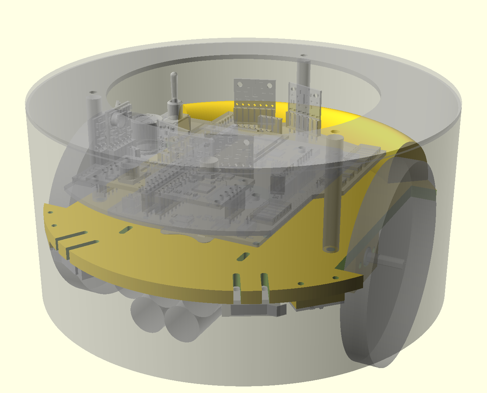

# Rug Rover

## Project Overview

When I first started pursuing robotics as a hobby back in the late 1990s, one of the first books I read was ["Mobile Robots: Inspiration to Implementation" by Joseph L. Jones and Anita M. Flynn](https://www.amazon.com/Mobile-Robots-Inspiration-Implementation-Second/dp/B0087P7X2S). I just read it again recently and the core lessons covered by the book are just as useful today as they were back at that time even though some of the technology discussed is now a bit out of date. The mechanical, electrical, motor physics, and behavior based programming topics covered are all still relevant. The Motorola 68HC11 microcontroller and Interactive C programming language are examples of some of the more dated topics.

After reading the book for the first time, I ordered one of the [Rug Warrior Pro kits](http://www.robotbooks.com/rug_warrior.htm) and assembled it. I enjoyed putting it together but never did a lot of experimentation with it as I never really got one of the wheel encoders to work properly. It seemed to pick up noise from the motor as erroneous encoder tick counts.

Having recently reread the book, I thought it would be fun to build a comparable robot using more recent technology. This Rug Rover project is my attempt to build such a robot. It features will include:
* Similar sensors/actuators:
  * Motors with encoders
  * IR proximity sensors
  * Bumper switches
  * Microphone
  * Speaker
  * Pyroelectric sensor
  * Photo Cell light level detectors
  * LCD
* Add in IR based downward facing cliff detectors so that I can run the robot in my loft and hopefully write software that stops it from trying to make a run down the stairs.
* More modern nRF52 BLE capable microcontroller:
  * I hope to exploit the BLE capabilities of this microcontroller to enable wireless debugging and programming.
  * Program in C/C++ using GCC.
  * Debug code using GDB.
* Mechanical components will be designed in CAD and 3D printed.
* Use KiCAD to design custom PCB for this bot. The first iteration of the PCB might be a shield for a nRF52 development kit that I already own. Later I could design a new PCB that uses a small nRF52 module, like those offered by Adafruit.

## Bill of Materials
| Quantity | Part Name / Link |
|---|-|
| 2 | [63:1 Metal Gearmotor 20Dx43L mm 6V CB with Extended Motor Shaft](https://www.pololu.com/product/3714) |
| 1 | [Magnetic Encoder Pair Kit for 20D mm Metal Gearmotors, 20 CPR, 2.7-18V](https://www.pololu.com/product/3499) |
| 2 | [TB9051FTG Single Brushed DC Motor Driver Carrier](https://www.pololu.com/product/2997) |
| 1 | [Pololu Multi-Hub Wheel w/Inserts for 3mm and 4mm Shafts - 80×10mm, Black, 2-Pack](https://www.pololu.com/product/3690) |
| 1 | [Supporting Swivel Caster Wheel - 1.3" Diameter](https://www.adafruit.com/product/2942) |
| 1 | [Pololu 3.3V, 500mA Step-Down Voltage Regulator D24V5F3](https://www.pololu.com/product/2842) |
| 1 | [Pololu 5V, 500mA Step-Down Voltage Regulator D24V5F5](https://www.pololu.com/product/2843) |
| 1 | [Pololu 12V Step-Up Voltage Regulator U3V40F12](https://www.pololu.com/product/4016) |
| 1 | [Adafruit I2S 3W Class D Amplifier Breakout - MAX98357A](https://www.adafruit.com/product/3006) |
| 1 | [Mini Oval Speaker - 8 Ohm 1 Watt](https://www.adafruit.com/product/3923) |
| 1 | [Adafruit PDM MEMS Microphone Breakout](https://www.adafruit.com/product/3492) |
| 1 | [Graphical OLED Display: 128x64, 1.3", White, SPI](https://www.pololu.com/product/3760) |
| 1 | [MCP23018T-E/SO - I/O Expander 16 I²C 3.4 MHz 28-SOIC](https://www.digikey.com/en/products/detail/microchip-technology/MCP23018T-E-SO/2002549) |
| 2 | [VL6180X Time-of-Flight Distance Sensor Carrier with Voltage Regulator, 60cm max](https://www.pololu.com/product/2489) |
| 5 | [VL53L1X Time-of-Flight Distance Sensor Carrier with Voltage Regulator, 400cm Max](https://www.pololu.com/product/3415) |
| 2 | [Photo cell (CdS photoresistor)](https://www.adafruit.com/product/161) |
| 3 | [Snap-Action Switch with 15.6mm Bump Lever: 3-Pin, SPDT, 5A](https://www.pololu.com/product/1405) |
| 1 | [PIR Motion Sensor](https://www.pololu.com/product/2731) |
| 1 | [Adafruit Precision NXP 9-DOF Breakout Board - FXOS8700 + FXAS21002](https://www.adafruit.com/product/3463) |
| 1 | [Diode Schottky 60 V 7A Surface Mount TO-277A ](https://www.digikey.com/en/products/detail/vishay-general-semiconductor-diodes-division/SS10P6-M3-86A/2152231) |
| 1 | [Toggle Switch SPDT Through Hole](https://www.digikey.com/en/products/detail/e-switch/100SP1T1B4M2QE/378824?s=N4IgTCBcDaIKIHEwGYCsqC0A5AIiAugL5A) |
| 1 | [Rechargeable NiMH Battery Pack: 6.0 V, 2200 mAh, 3+2 AA Cells, JR Connector](https://www.pololu.com/product/2224) |
| 1 | [Red Dirt Derby 2 oz Tungsten Putty Weights](https://www.amazon.com/Red-Dirt-Derby-Tungsten-Pinewood/dp/B06Y5FDLL6) |
| 1 | [1/4" OD Black Latex Tubing for Bumper Skirt Standoffs](https://www.amazon.com/LATEX-TUBING-602-BLACK-10FT/dp/B074NCLZSW) |
| X | Already owned 0805 passives, 0.1" headers, etc. |

**Notes:** I didn't end up with enough spare pins on version 1 of the PCB to connect the microphone and I2S audio components. I will experiment with these devices off of the robot for now and then add them on the next revision of the board.

## Mechanical Design
When it comes to robot building, the mechanical portions are my weakest area. On some other robot projects I have started with software drivers and then never got around to even starting on the mechanical portions since I wasn't really looking forward to it. Best to get it out of the way first on this project. Doing it first also means that I have something physical to look at and hold earlier in the project to help keep me motivated.

**Mechanical Highlights:**
* 3D print the mechanical parts for this robot in PETG.
* Use OpenSCAD for the 3D design.
* The following parts will be mounted to the underside of the robot chassis:
  * 2 x Motors
  * 1 x Caster
  * 2 x Cliff Detection Sensors (VL6180X) mounted in front of the wheels.
  * 3 x Micro Switches to detect bumper collisions.
  * 1 x 5 cell (6V) NiMH rechargeable battery.
* Chassis has holes for attachment of following parts to the topside of the chassis:
  * 5 x Standoffs for Nordic nRF52-DK Development Kit PCB to which shield with remaining sensors/actuators will be mounted.
  * 3 x Flexible Rubber Tube Standoffs to which the bumper skirt is attached, allowing bumper to move and press against micro switches when an obstacle is encountered.
  * Will probably also need at least 50g of counterweight in the back to move the center of mass closer to the caster so that the robot doesn't nose dive during quick decelerations. Only having room for the batteries at the front of the bot increases the need for this counterweight.
* A separate bumper skirt is printed to enclose the robot.
  * It is mounted to the chassis on flexible rubber tube standoffs like the Rug Warrior Pro.

## Electronics Design
Once I had the mechanical design mostly figured out, I moved onto the design of the electronics in [KiCad](https://www.kicad.org).

**Electronic Highlights:**
* The initial version of the electronics will use the [Nordic nRF52 DK](https://www.nordicsemi.com/Products/Development-hardware/nrf52-dk) as its base and the custom robot electronics will be added as a custom shield.
* The shield design is 4-layer to make it easier to route the signals all around the board without worrying about ground and power. The layout is a bit complicated as the Arduino header format used by the nRF52 DK has most of the signals on one side of the board but I want to place input/output connectors on both sides of the board.
* Most of the sensors and actuators are connected to the PCB via 0.1" headers.
* Version 1 of the shield includes:
  * Dual TB9051FTG motor controllers
  * Quadrature motor encoders
  * Dual photo cells
  * PIR motion sensor
  * Three switches for bumper skirt obstacle detection
  * SPI based OLED screen
  * One I2C bus for connection to:
    * 5 x VL53L1X ToF Obstacle Detection Sensors (3 front facing & 2 back facing).
    * 2 x VL6180X ToF Cliff Detection Sensors mounted in front of the wheels.
    * 1 x Adafruit Precision NXP 9-DOF IMU
    * 1 x 16 channel MCP23018 I/O port expander used for:
      * Asserting VL53L1X and VL6180X XSHUT pins to init each one separately and give them unique I2C addresses.
      * Reading of the multiple VL53L1X and VL6180X GPIO pins.
 * Multiple voltage supplies:
   * 6V Directly from Batteries for Motors
   * 5V from Buck Regulator for TB9051FTG Motor Controllers
   * 12V from Boost Regulator for PIR Sensor
   * 3.3V from Buck Regulator for rest of Electronics

The board design has now been sent off to [OSHPark](https://oshpark.com) for fabrication.

 

[Schematic PDF](hardware/shield.pdf) 
