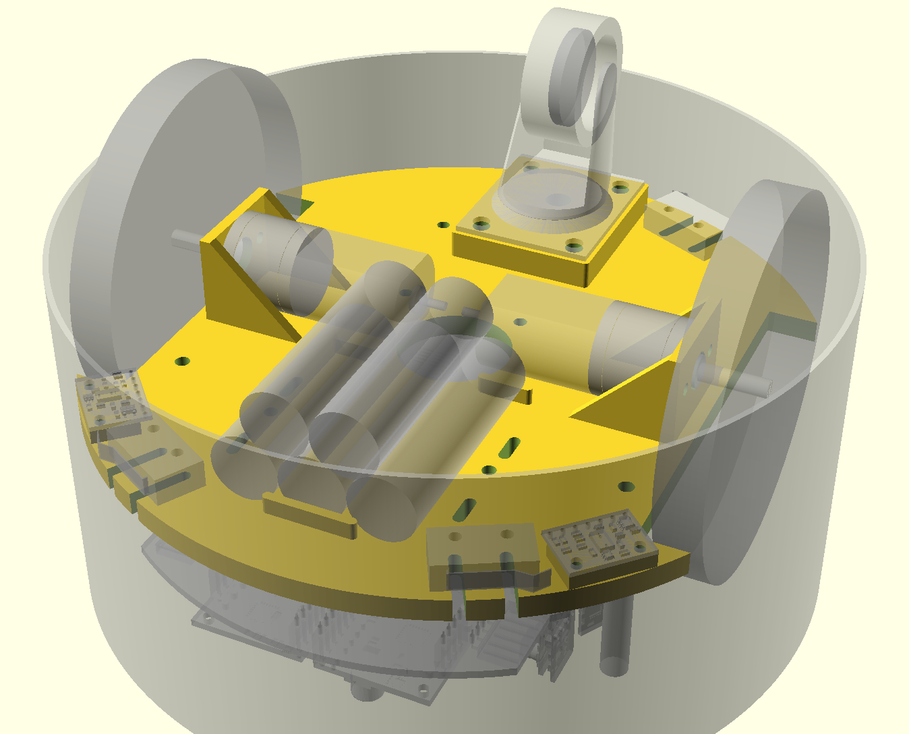

# Rug Rover
## Project Overview

When I first started pursuing robotics as a hobby back in the late 1990s, one of the first books I read was ["Mobile Robots: Inspiration to Implementation" by Joseph L. Jones and Anita M. Flynn](https://www.amazon.com/Mobile-Robots-Inspiration-Implementation-Second/dp/B0087P7X2S). I just read it again recently and the core lessons covered by the book are just as useful today as they were back at that time even though some of the technology discussed is now a bit out of date. The mechanical, electrical, motor physics, and behavior based programming topics covered are all still relevant. The Motorola 68HC11 microcontroller and Interactive C programming language are examples of some of the more dated topics.

After reading the book for the first time, I ordered one of the [Rug Warrior Pro kits](http://www.robotbooks.com/rug_warrior.htm) and assembled it. I enjoyed putting it together but never did a lot of experimentation with it as I never really got one of the wheel encoders to work properly as it seemed to pick up noise from the motor as erroneous encoder tick counts.

Having recently reread the book, I thought it would be fun to build a comparable robot using more recent technology. This Rug Rover project is my attempt to build such a robot. It features will include:
* Similar sensors/actuators:
  * Motors with encoders
  * IR proximity sensors
  * Bumper switches
  * Microphone
  * Speaker
  * Pyroelectric sensor
  * Photo Cell light level detectors
  * LCD
* Add in IR based downward facing cliff detectors so that I can run the robot in my loft and hopefully write software that stops it from trying to make a run down the stairs.
* More modern nRF52 BLE capable microcontroller:
  * I hope to exploit the BLE capabilities of this microcontroller to enable wireless debugging and programming.
  * Program in C/C++ using GCC.
  * Debug code using GDB.
* Mechanical components will be designed in CAD and 3D printed.
* Use KiCAD to design custom PCB for this bot. The first iteration of the PCB might be a shield for a nRF52 development kit that I already own. Later I could design a new PCB that uses a small nRF52 module, like those offered by Adafruit, instead.

## Bill of Materials
**Photo of the parts that I have so far**
| Quantity | Part Name / Link |
|---|-|
| 2 | [63:1 Metal Gearmotor 20Dx43L mm 6V CB with Extended Motor Shaft](https://www.pololu.com/product/3714) |
| 1 | [Magnetic Encoder Pair Kit for 20D mm Metal Gearmotors, 20 CPR, 2.7-18V](https://www.pololu.com/product/3499) |
| 2 | [TB9051FTG Single Brushed DC Motor Driver Carrier](https://www.pololu.com/product/2997) |
| 1 | [Pololu Multi-Hub Wheel w/Inserts for 3mm and 4mm Shafts - 80×10mm, Black, 2-Pack](https://www.pololu.com/product/3690) |
| 1 | [Supporting Swivel Caster Wheel - 1.3" Diameter](https://www.adafruit.com/product/2942) |
| 2 | [Pololu 3.3V, 500mA Step-Down Voltage Regulator D24V5F3](https://www.pololu.com/product/2842) |
| 1 | [Adafruit I2S 3W Class D Amplifier Breakout - MAX98357A](https://www.adafruit.com/product/3006) |
| 1 | [Mini Oval Speaker - 8 Ohm 1 Watt](https://www.adafruit.com/product/3923) |
| 1 | [Adafruit PDM MEMS Microphone Breakout](https://www.adafruit.com/product/3492) |
| 1 | [Graphical OLED Display: 128x64, 1.3", White, SPI](https://www.pololu.com/product/3760) |
| 2 | [VL6180X Time-of-Flight Distance Sensor Carrier with Voltage Regulator, 60cm max](https://www.pololu.com/product/2489) |
| 6 | [VL53L1X Time-of-Flight Distance Sensor Carrier with Voltage Regulator, 400cm Max](https://www.pololu.com/product/3415) |
| 2 | [Photo cell (CdS photoresistor)](https://www.adafruit.com/product/161) |
| 3 | [Snap-Action Switch with 15.6mm Bump Lever: 3-Pin, SPDT, 5A](https://www.pololu.com/product/1405) |
| 1 | [PIR Motion Sensor](https://www.pololu.com/product/2731) |
| 1 | [Rechargeable NiMH Battery Pack: 6.0 V, 2200 mAh, 3+2 AA Cells, JR Connector](https://www.pololu.com/product/2224) |

## Mechanical Design
When it comes to robot building, the mechanical portions are my weakest area. For that reason, I started with the mechanical design of the project first. On some other robot projects I have started with software drivers and then never got around
to even starting on the mechanical portions since I wasn't really looking forward to it.

**Mechanical Highlights:**
* 3D print the mechanical parts for this robot in PETG.
* Use OpenSCAD for the 3D design.
* The following parts will be mounted to the underside of the robot chassis:
  * 2 x Motors
  * 1 x Caster
  * 2 x Cliff Detection Sensors (VL6180X) mounted in front of the wheels.
  * 3 x Micro Switches to detect bumper collisions.
* Chassis has holes for attachment of following parts to the topside of the chassis:
  * 5 x Standoffs for Nordic nRF52-DK Development Kit PCB to which shield with remaining sensors/actuators will be mounted.
  * 3 x Rubber Tube Standoffs to which bumper is attached, allowing bumper to move and press against micro switches when an obstacle is encountered.

