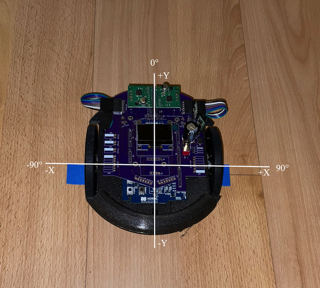

# Navigate Class
This class serves 2 purposes:
* Track the robot's real world location (in mm) and heading (in radians).
* Automatically navigate between a list of user specified waypoints.

The robot can also accept commands that tell it what speed and direction to go instead of automatically navigating to waypoints. This class will still track the robot's real world location when run in this non-automated fashion.

The origin of the robot's world view is its location at the time of reset. It also views the direction it was facing at the time of reset as 0 degrees with clockwise rotations resulting in positive angles and counterclockwise rotations resulting in negatives angles.



## Constructor
```c++
Navigate(DifferentialDrive* pDrive, float ticksPerRotation,
            float leftWheelDiameter_mm, float rightWheelDiameter_mm, float wheelbase_mm,
            float distanceThreshold_mm, float angleThreshold_radians, float headingRatio, uint32_t brakeSamples,
            float headingPidKc, float headingPidTi, float headingPidTd,
            float distancePidKc, float distancePidTi, float distancePidTd);
```
* **pDrive**: A pointer to the DifferentialDrive object that has been setup for closed loop PID control of the 2 motors on the robot. I thought about deriving the Navigate class from DifferentialDrive or encapsulating it but decided to instead let the caller initialize and own it instead. The parameter list for the ```Navigate::Navigate()``` constructor is already so long, adding the ones needed to initialize DifferentialDrive as well would make it humongous.
* **ticksPerRotation**: The number of encoder ticks that will be generated for each rotation of the wheel. For the motor/encoder combo that I am currently using on the RugRover this will be: **20 ticks/motor_rev * 62.5 gear_ratio = 1250 ticks/wheel_rev**.
* **leftWheelDiameter_mm**: The diameter of the left wheel in mm. Nominally both wheels are supposed to be 80mm in diameter. I will discuss a bit more about how I fine tuned the measurement for both wheels later in the [calibration section](#calibration).
* **rightWheelDiameter_mm**: The diameter of the right wheel in mm. Nominally both wheels are supposed to be 80mm in diameter. I will discuss a bit more about how I fine tuned the measurement for both wheels later in the [calibration section](#calibration).
* **wheelbase_mm**: The distance between the 2 wheels. The CAD design has the distance between the two wheels as 128.1868mm. When I did the calibration process described [below](#calibration) it turned out that this CAD measurement was pretty accurate.
* **distanceThreshold_mm**: How close, in mm, does the robot need to be to a waypoint before it is considered reached.
* **angleThreshold_radians**: How close, in radians, does the robot need to be pointed towards the desired location (next waypoint, etc) before a turn is considered done.
* **headingRatio**: The maximum turning speed while driving forward is constrained so that it doesn't exceed the current drive speed and attempt to run one of the motors in reverse. This ratio specifies how much of the current forward speed should be used for constraining the heading control loop. It should be a positive float value > 0.0f and <= 1.0f.
* **brakeSamples**: When braking between stages, wait for this many samples to return 0 encoder ticks before considering the stop to be complete.
* **headingPidKc, headingPidTi, headingPidTd**: These are the PID (Proportional, Integral, Derivative) parameters for the closed loop control system used for maintaining the desired heading. Currently I just use the P & I terms, leaving the D term set to 0.0f. The [calibration section](#calibration) contains notes on how I calculated them for this robot.
* **distancePidKc, distancePidTi, distancePidTd**: These are the PID (Proportional, Integral, Derivative) parameters for the closed loop control system used for determining the forward travel speed based on distance to the next waypoint. Currently I just use the P & I terms, leaving the D term set to 0.0f. The [calibration section](#calibration) contains notes on how I calculated them for this robot.

## Waypoints
The user can call setWaypoints() to provide a list of ```Position``` structures representing the locations to which the robot should navigate and in which direction the robot should face after it reaches each waypoint. Currently it only makes sense to use the heading field for the last waypoint as the robot will always followup this heading with one that faces the next waypoint. I do have some ideas of how to make beter use of it in the future though.

```c++
struct Position
{
    // Coordinates of this waypoint in mm.
    float x;
    float y;
    // The angle the robot should be turned to face once waypoint is reached. Can be NAN if no turn is desired.
    float heading;
};
```

The robot goes through 2-3 stages for each waypoint:
1. First it turns in place to face the waypoint.
2. Next it drives towards the specified x/y coordinates of the waypoint.
3. It will then turn in place again to face the desired heading if such a heading is given in the waypoints ```heading``` field of its ```Position``` structure.

## update() Method
The method should be called at the PID frequency (currently 100Hz) to update all of the PID based control loops, update the robot's position estimate based on recent wheel movement, and continue to progress through the waypoints.

## drive() Method
This method like the ```update()``` method should be called at the PID frequency but it ignores the waypoint list and instead commands the wheels to spin at the caller specified velocities (in meters/s). It also updates the robot's position estimated based on recent wheel movement.

## Logging
Sometimes I see the robot do something unexpected as it is running along on the floor and I want to take a peek at things like the robot's position and/or heading that would account for why it suddenly decided to do something that I wasn't expecting. I have added 2 methods to allow for logging from within the Navigate class:

```c++
void setLogBuffer(void* pLog, size_t logSize);
bool dumpLog(const char* pFilename);
```

The ```setLogBuffer()``` method allows the user to provide a byte array into which the Navigate module can log. This buffer is provided by the caller so that it responsible for allocating it if it wants to actually make use of it. This way the Navigate module doesn't need to allocate a log buffer that the caller isn't going to make use of or have a way to dynamically allocate it on an embedded platform that isn't well setup for such allocations. This buffer needs to be an even multiple of 4-bytes as that is the size of each sample (only needs to log 8-bit signed values for encoder tick deltas and motor power settings for each of the wheels). This will be used as a circular buffer and will only contain the most recent entries if the test should run longer than there is buffer to hold all of the samples taken during a run.

The ```dumpLog()``` method opens up a .CSV file on the host computer where GDB is running. Compressed 8-bit signed values are logged to memory for each sample so this method will expand these logged values to determine total encoder ticks accumulated, absolute robot's location in mm, and the robot's heading at each sample. This does mean that the samples will be serialized out to the .CSV file in reverse chronological order since this makes the decompression easier.

## Calibration
Odometry requires accurate values for the left/right wheel diameters and wheelbase between the two wheels. The [Navigating Mobile Robots book by Borenstein et al](http://www-personal.umich.edu/~johannb/Papers/pos96rep.pdf) contains a method for calibrating these parameters but I chose to use a simpler approach but still use their clockwise and counterclockwise tests to verify the odometry after calibration.

The debug menu in [software/main.cpp](../main.cpp) has routines which help run tests to calibrate these parameters:
```console
Debug Menu
1. Test Navigate
2. Test PID
3. Run Speed PID calibration
4. Run Heading PID calibration
5. Run Distance PID calibration

Select:
```

### Wheel Diameters
This is the rough process that I used to calibrate the diameter of the wheels:
* Marked location on floor where each wheel starts the test.
* Ran the straight driving test as seen in the console log below:
```console
Debug Menu
1. Test Navigate
2. Test PID
3. Run Speed PID calibration
4. Run Heading PID calibration
5. Run Distance PID calibration

Select: 1


Update odometry settings.
Just press <Return> to keep current setting.
Left Wheel Diameter in mm (80.680000):
Right Wheel Diameter / Left Wheel Diameter ratio (0.996000):
Wheel base in mm (128.186798):

Drive (s)traight, (t)urn in place, (c)lockwise, (x)counter-clockwise: s
```
* Noted the total left/right encoder ticks from the OLED or first line of the test_navigate.csv log file.
* Used a measuring tape to determine the distance each wheel had traveled during the test.


* The distance measurements and encoder tick counts were then entered in my [docs/wheel_diameter.numbers spreadsheet](../../docs/wheel_diameter.numbers) to determine better estimates for the actual wheel diameters.


### Wheelbase
This is the rough process that I used to calibrate the wheelbase, the distance between the wheels of the robot:
* I drew vertical and horizontal lines going through the center of a piece of paper. I then taped this paper down to the floor and placed the center of the robot over the center of the paper with the horizontal line directly beneath the wheel axles.
* Ran the turn in place test as seen in the console log below:
```console
Debug Menu
1. Test Navigate
2. Test PID
3. Run Speed PID calibration
4. Run Heading PID calibration
5. Run Distance PID calibration

Select: 1


Update odometry settings.
Just press <Return> to keep current setting.
Left Wheel Diameter in mm (80.680000):
Right Wheel Diameter / Left Wheel Diameter ratio (0.996000):
Wheel base in mm (128.186798):

Drive (s)traight, (t)urn in place, (c)lockwise, (x)counter-clockwise: t
```
* Noted the robot's final heading estimate from the OLED or first line of the test_navigate.csv log file.
* Used a protractor to measure the robot wheel's actual angle and compared it to the robot's estimate. I got lucky and the two values just matched but if the robot's estimate was too large then the wheelbase should be increased a bit and vice versa.

### Heading/Distance PI
The Debug Menu on the robot has options for running heading and distance PI calibration routines. These routines oscillate the robot via in place rotations or straight back and forth motions. These test routines are 4 and 5 in the list below:
```console
Debug Menu
1. Test Navigate
2. Test PID
3. Run Speed PID calibration
4. Run Heading PID calibration
5. Run Distance PID calibration
```
Once these tests are done running, they look through the data looking for the range and timings of the oscillations and use them to calculate parameters to model its behavior and can be used to calculate good PI parameters for each of the control loops.

**Example Output from "Run Heading PID calibration"**
```console
Calculated PID Model Parameters
slope1 = 2.914975
slope2 = -3.094060
CO1 = 0.250000
CO2 = -0.250000
Kp* = 12.018072
Өp = 0.114456
Tc = 0.343369
Kc = 0.318056
Ti = 0.801193
```

**Example Output from "Run Distance PID calibration"**
```console
Calculated PID Model Parameters
slope1 = 222.512833
slope2 = -224.032501
CO1 = 0.250000
CO2 = -0.250000
Kp* = 893.090698
Өp = 0.118901
Tc = 0.356702
Kc = 0.004120
Ti = 0.832304
```

These tests also generate .CSV files which can be loaded into a spreadsheet and graphed to see how the process responds to changes in control output.

## Future Improvements
This is a pretty good start to this class but I will probably come back in the future to address a few issues:
* ~~Improve how well it tracks between waypoints. It sometimes takes an unexpected curvy approach.~~
* Have a way to pause at each waypoint and let the caller know when each has been reached so that it can run specific actions at waypoints. And example would be finding and touching a traffic cone when a waypoint close to the cone has been reached.
